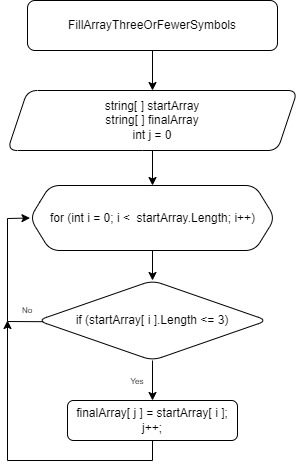

# Итоговая проверочная работа

## *Задача:*  
Написать программу, которая из имеющегося массива строк формирует массив из строк, длина которых меньше либо равна 3 символам. первоначальный массив можно ввести с клавиатуры, либо задать на старте выполнения алгоритма. При решении не рекомендуется пользоваться коллекциями, лучше обойтись исключительно массивами.

## *Примеры:*  
["hello", "2", "world", ":-)"] -> ["2",":-)"]  
["1234", "1567", "-2", "computer science"] -> ["-2"]  
["Russia", "Denmark", "Kazan"] -> [ ]

## *Описание решения:*  
### *Алгоритм*
Создаются два массива одинаковой длины. Длина массивов зависит от количества элементов, которые будут введены или заданы на старте выполнения алгоритма. В первый массив вносятся первоначальные элементы. Во втором массиве будут сохранены элементы, соответсвующие условию задачи. Решение задачи выполнено через цикл. Внутри цикла осуществляется проврека условия длины каждого элемента первого массива, которая должна быть меньше либо равна 3(трем) символам. В случае соответствия условию, элемент из первого массива сохраняется во втором массиве.

### *Блок-схема алгоритма*
Блок-схема основной содержательной части алгоритма представлена в виде метода на рисунке ниже.

### *Решение задачи на языке C#*

